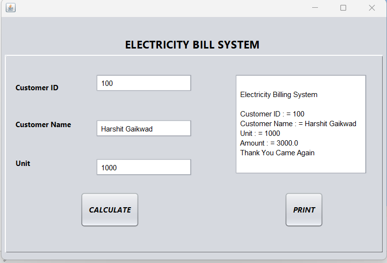

# Electricity Bill Printing System 

# project-documentation

  

<h3 align="center">Electricity Bill</h3>

---

 An electricity bill printing system is a software application that generates and prints out electricity bills for customers. The system typically receives inputs such as the customer's name, address, meter reading, and tariff rate. It then calculates the bill amount based on these inputs and generates a bill with all the relevant details.
      

## 📝 Table of Contents
- [About](#about)
- [Getting Started](#getting_started)
- [Deployment](#deployment)
- [Usage](#usage)
- [Flow Chart](#flowchart)
- [TODO](../TODO.md)
- [Contributing](../CONTRIBUTING.md)
- [Authors](#authors)
- [Acknowledgments](#acknowledgement)

## 🧐 About 
An effective electricity bill printing system will usually have a user-friendly interface and intuitive navigation. It should be able to handle large volumes of customer data, store and retrieve this data from a database, and generate bills automatically based on meter readings. The system may also be integrated with other software applications such as accounting systems, customer service tools, and mobile payment gateways.
## 🏁 Getting Started 
 Here are the general steps to get started with an electricity bill printing system project:

Define the requirements: The first step is to define the requirements for the electricity bill printing system. This includes identifying the features and functionality required, such as customer information management, meter readings, bill generation, and payment processing.

Plan the project: Once the requirements are defined, plan the project by breaking it down into smaller tasks and creating a project timeline. This will help to ensure that the project is completed on time and within budget.

Choose the programming language and technology stack: Based on the project requirements and your team's expertise, choose a programming language and technology stack to develop the system. Some popular options include Java, Python, and PHP for the backend, and HTML, CSS, and JavaScript for the frontend.

Design the data model: Define the data model for the electricity bill printing system, including the data structures and objects that will be used to store customer information, meter readings, billing data, and payment information.

Implement the user interface: Develop the user interface for the electricity bill printing system, including screens and forms that allow users to input and manage customer information, meter readings, and billing data.

Develop the business logic: Implement the business logic for the electricity bill printing system, including the algorithms and processes used to generate bills, calculate tariffs, and process payments.

Test the system: Test the electricity bill printing system thoroughly to ensure that it meets the requirements and functions as expected.

Deploy the system: Once the system is tested and validated, deploy it to a production environment and make it available to users.

By following these steps, you can get started with developing an electricity bill printing system project that meets your organization's needs and delivers value to your customers.

### Prerequisites
REQUIREMENTS OF PROJECT:-
 Window 10/XP
 Installed java editor 
 Installed java jre
Installed java jdk
 Installed Net Beans

### Installing
Download NetBeans: Go to the NetBeans download page and select the version of NetBeans you want to install. Choose the version that is compatible with your operating system.

Install JDK: NetBeans requires the Java Development Kit (JDK) to be installed on your system. If you do not already have it installed, download and install the appropriate version of JDK for your operating system.

Run the NetBeans installer: Once you have downloaded NetBeans, run the installer by double-clicking on the downloaded file.

Choose installation options: During the installation process, you will be prompted to choose the installation options. You can choose the default options or customize the installation to include only the components you need.

Accept the license agreement: To proceed with the installation, you must accept the license agreement.

Choose installation directory: You can choose the directory where you want to install NetBeans. By default, NetBeans is installed in the Program Files directory on Windows systems.

Install NetBeans: Once you have chosen the installation options and directory, click the Install button to begin the installation process.

Finish the installation: After the installation is complete, you can choose to launch NetBeans immediately or exit the installer.

Verify the installation: To verify that NetBeans is installed correctly, launch the application and create a new project.

End with an example of getting some data out of the system or using it for a little demo.

## 🔧 Running the tests 
Choose a testing framework: Choose a testing framework that is suitable for the programming language and technology stack used to develop the electricity bill printing system. Popular testing frameworks for Java-based applications include JUnit, TestNG, and Selenium.

Write test cases: Create test cases that cover the functionality and features of the electricity bill printing system. These test cases should include both positive and negative scenarios to ensure that the system handles edge cases and error conditions properly.

Implement the tests: Implement the test cases using the chosen testing framework. This involves writing code that automates the test scenarios and checks the system's response.

Run the tests: Once the tests are implemented, run them to ensure that they execute successfully and generate the expected output.

Analyze the test results: Analyze the test results to identify any failures or issues that need to be addressed. This may involve debugging the code or making changes to the system to fix the issues.

Repeat the testing process: Once the issues are addressed, repeat the testing process to ensure that the system functions correctly and that the changes made do not introduce any new issues.

Integrate with a Continuous Integration (CI) tool: To automate the testing process, you can integrate the automated tests with a CI tool such as Jenkins or CircleCI. This allows you to run the tests automatically whenever there are changes to the codebase or on a regular schedule.

### Break down into end to end tests
By following these steps, you can run automated tests for your electricity bill printing system and ensure that it is functioning as expected.
<<<<<<< HEAD

=======
>>>>>>> ccb3ef98e38119bc8d4d95dd9750ea018ced0479
## 🎈 Usage 
Login: The electricity bill printing system may require you to login with your credentials before you can access the system. You may need to enter your username and password to log in.

Navigation: Once you are logged in, you will see the system dashboard, which provides an overview of the system's functionality. You can navigate through the system using the menu or sidebar, which lists the different sections and options available in the system.

Adding new customers: To add a new customer to the system, click on the "Add New Customer" button or link. You may be prompted to enter the customer's details, such as name, address, and contact information.

Generating bills: To generate a bill for a customer, select the customer from the list and click on the "Generate Bill" button. The system will generate a bill based on the customer's usage and the electricity rates.

Viewing bills: To view a customer's bill, select the customer from the list and click on the "View Bill" button. The system will display the bill details, including the amount due and the due date.

Updating customer information: To update a customer's information, select the customer from the list and click on the "Edit" button. You can then update the customer's details and save the changes.

Payment processing: Once a customer has paid their bill, you can mark the bill as paid in the system. You may need to enter the payment details, such as the amount paid and the date of payment.

Reports and analytics: The electricity bill printing system may also provide reports and analytics that can help you monitor the system's performance and track usage patterns. You can access these reports and analytics from the system's dashboard or menu.

## 🚀 Deployment 
Choose a deployment platform: There are several deployment platforms available for hosting web applications, such as Heroku, AWS, and Google Cloud. Choose a deployment platform that suits your needs and budget.

Configure the server: Configure the server with the necessary software and tools to run the electricity bill printing system. This may involve installing a web server, database server, and other dependencies required by the system.

Build the application: Build the electricity bill printing system application using a build tool such as Maven or Gradle. This will create a deployable artifact that can be deployed to the server.

Deploy the application: Deploy the application to the server using the deployment platform's tools or command line interface. This may involve uploading the artifact to the server and configuring the application to run properly.

Configure the environment: Configure the environment variables and settings required by the application, such as database connection strings and API keys.

Test the deployment: Test the deployed application to ensure that it is working as expected and that all features and functionality are accessible.

Monitor the deployment: Monitor the deployed application to ensure that it is running smoothly and that there are no performance or security issues
## ⛏️ Flow Chart 

[bg width:1000px](HarshitXXXX/EBill/BillPrintingSystem.webp)

## ✍️ Authors 
- [@SkillLync](Harshit Bhagwan Gaikwad) - FSD

## 🎉 Acknowledgements 
The authors sincerely express their gratitude to the engineers working  in  the  Babylon  province  electricity  department  to evaluate the implementation of  the system and  evaluate  the obtained results and the extent of interest from them
